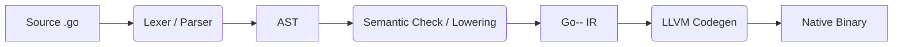

# go--
The go-- compiler targets a significant subset of the Go programming language. Validates Go programs and produces native executables.

You can find the first version of this compiler (this is the third) here: https://github.com/obround/go.rs.

## Build and Usage

### Requirements

- Rust toolchain (latest)
- Clang
- LLVM 21
- Make
- Bohem GC

### Building
Clone the repository and run `make`:

```bash
git clone https://github.com/obround/go--
cd go--
make
```

This will create an executable `bin/go--`.

### Running

To compile and run a Go source file:

```bash
/bin/go-- examples/mandelbrot.go
./examples/mandelbrot.go
```

You can also inspect the generated LLVM IR using the `--emit-llvm` option.

## Examples

### Mandelbrot


## Ray Tracer

```bash
/bin/go-- examples/rayTracer.go
./examples/rayTracer > image.ppm
```


## Donut.c & Endoh's Fluid Simulation

```bash
bin/go-- examples/donut.go
bin/go-- examples/fluidSim.go

./examples/donut
./examples/fluidSim
```

 

## Language Support

The go-- compiler supports a respectable subset of Go programs with many constructs: structs, methods, slices, arrays, maps, etc.

However, it notably does not support (yet): Interfaces, packages, concurrency, multi-file code, and some syntactic sugars

## How it works



I am planning on rewriting the analysis phase to separate semantic checking and lowering -- this should make for significantly cleaner code. I also plan to push some of my local tests
for both the semantic checking and code generation phases.

## License

MIT
